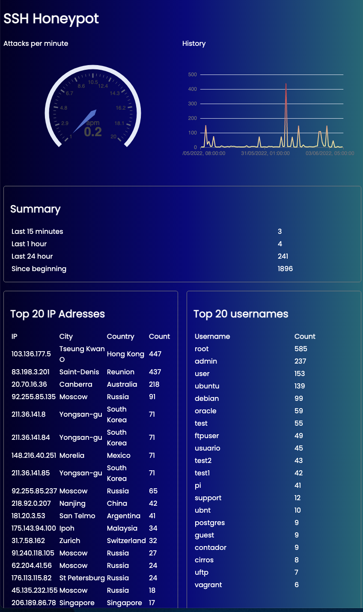

# SSH Honeypot with realtime dashboard

## Features

- Current attack rate
- Graph with number of recent attacks
- Top 20 IP addresses with count
- Top 20 usernames with count
- Top 20 passwords with count
- 20 most recent attacks with ip, username and password



## One command quick start
`sudo curl https://raw.githubusercontent.com/frnkst/ssh-honeypot/main/setup_server.sh | bash`

## Quick start

- Run `git clone https://github.com/frnkst/ssh-honeypot.git`
- `cd ssh-honeypot`
- `git reset --hard && git pull && chmod +x run.sh && ./run.sh`
- Navigate to `http://<ip-address>:40001` to see the dashboard

## Get started on a new server

- Install docker: https://docs.docker.com/engine/install/debian/
- Install python and pip `apt-get install python3-pip`
- Change real ssh port. Edit /etc/ssh/sshd_config and change port to 7777 for example
- Restart the ssh service: sudo service ssh restart
- Forward port 22 to port 2222 where the honeypot is running. Like this you can run the honeypot as a non root user which add to security: `/sbin/iptables -A PREROUTING -t nat -p tcp --dport 22 -j REDIRECT --to-port 2222`
- For debugging the database you can install the postgres cli: 
```
apt install postgresql-client-common
sudo apt-get install postgresql-client
```

## Architecture


## Useful links
- https://chartio.com/resources/tutorials/how-to-list-databases-and-tables-in-postgresql-using-psql/
- https://pynative.com/python-postgresql-insert-update-delete-table-data-to-perform-crud-operations/#h-python-postgresql-insert-into-database-table
- https://typeofnan.dev/how-to-serve-a-react-app-with-nginx-in-docker/


