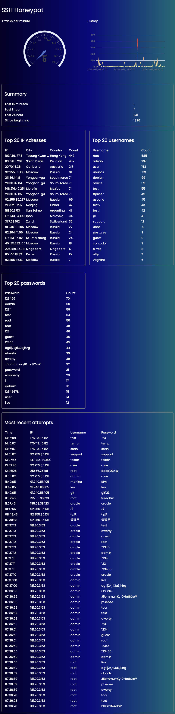

# SSH Honeypot with realtime dashboard

## Quick start for a fresh linux server
1) `sudo curl https://raw.githubusercontent.com/frnkst/ssh-honeypot/main/setup_server.sh | bash`
2) Change real ssh port. Edit `/etc/ssh/sshd_config` and change port to `7777` for example
3) Restart the ssh service: `sudo service ssh restart`

## Features
- Current attack rate
- Graph with number of recent attacks
- Top 20 IP addresses with count
- Top 20 usernames with count
- Top 20 passwords with count
- 20 most recent attacks with ip, username and password

## Architecture

## Useful links
- https://chartio.com/resources/tutorials/how-to-list-databases-and-tables-in-postgresql-using-psql/
- https://pynative.com/python-postgresql-insert-update-delete-table-data-to-perform-crud-operations/#h-python-postgresql-insert-into-database-table
- https://typeofnan.dev/how-to-serve-a-react-app-with-nginx-in-docker/
